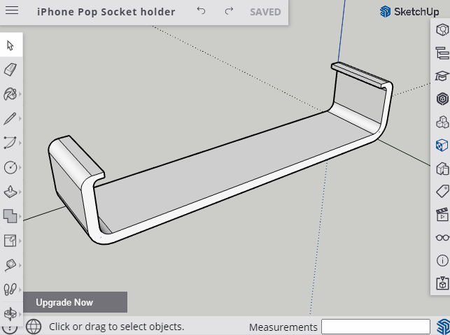

# Collection of 3D Prints

I want to share some of my creations such that you can get inspired. Creating models for a 3D printer is actually not that hard! I personally use [SketchUp](https://app.sketchup.com/app) to do quick sketches of what I want to create. However, SketchUp and other free modeling software are either hard to learn or have many limitations. Therefore I sometimes also use [OpenSCAD](https://www.openscad.org/) together with [`openpyscad`](https://github.com/taxpon/openpyscad) such that I can code my creations. This way I do not have any limitations and I get full control as I am free to use variables and other perks with programming, like for-loops and functions.

This is how I work with SketchUp and OpenSCAD:

|                  SketchUp                   | OpenSCAD                                    |
| :-----------------------------------------: | :------------------------------------------ |
|  |  |

When they are done, or I need to test them, I export the files to a STL-format such that I can drag them into my 3D printer software and print it out. That is it!
