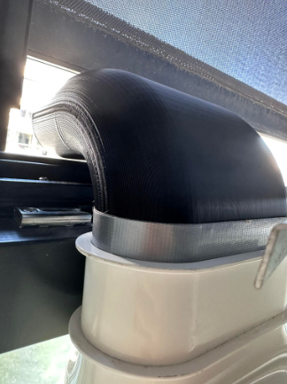

# Nozzle tip for Air Conditioner tube

## Problem

Too much hot air from the AC tube went back inside again, because of difficult design, which led to less efficient cooling (also more loss of energy than needed).

## Solution

Create a nozzle tip for the AC tube that directs the hot air straight out of the window.

## Result

Much cooler now!

