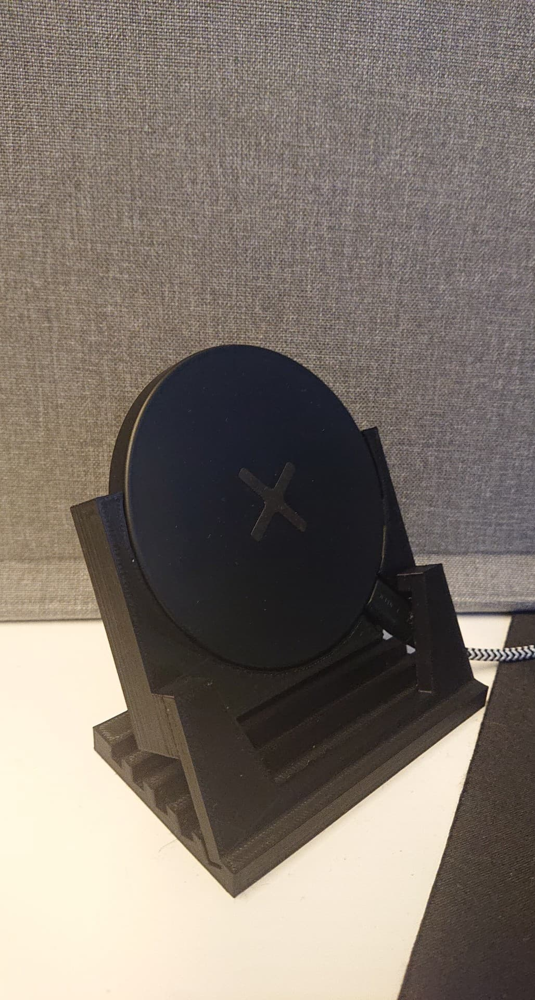
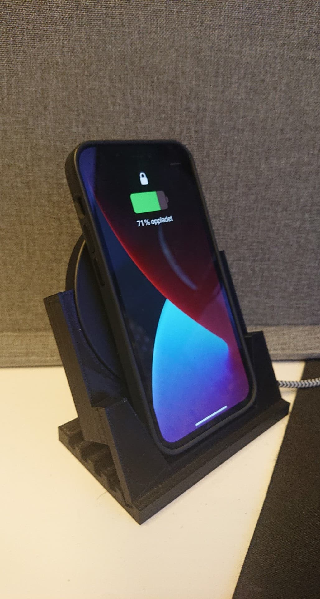
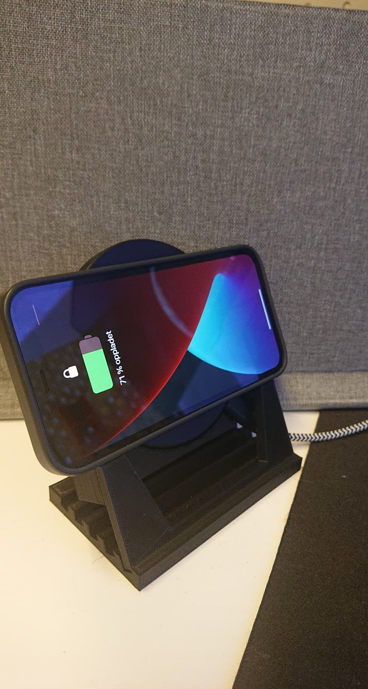
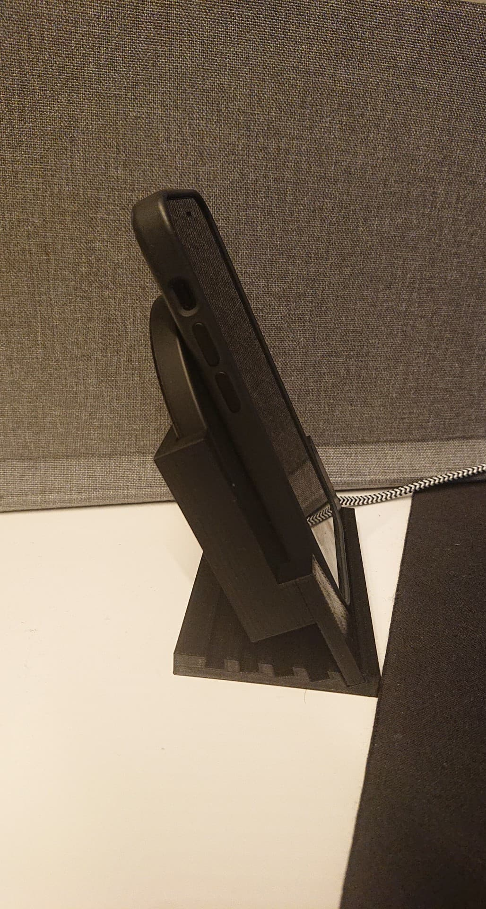
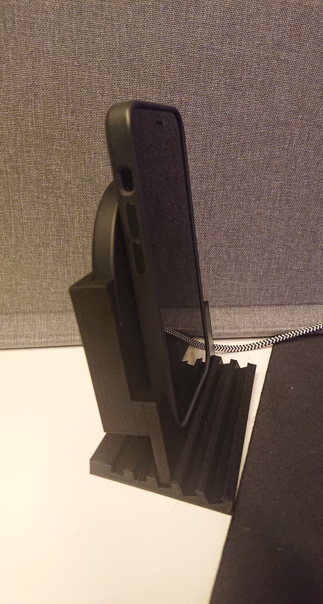

# Adjustable wireless charger stand for phones



It is possible to generate model with custom phone and charger size by setting these variables in the `main.py` file:

```python
device_depth = cm(1) # Insert into: cm(<here>)
device_width = cm(6.8)
device_height = cm(13.5)
device_bottom_offset = cm(0.8)
...
charger_radius = cm(4.6)
charger_depth = cm(1)
...
```

After that, you can run the file: `python main.py`, and three files are generated: `main-part.scad`, `bottom-part.scad` and `all-parts.scad`. Then use OpenSCAD to render `bottom-part` and `main-part` and export them to .STL files - which can then be 3D printed.

## Features

### 1. Switch between portrait and landscape mode




### 2. Possible to adjust the angle (30°, 22.5°, 15°, 7.5°, 0°)



