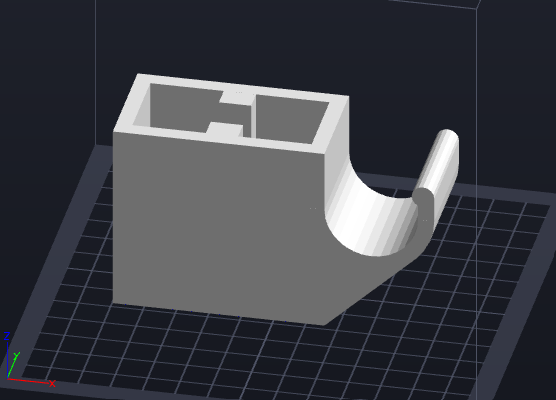
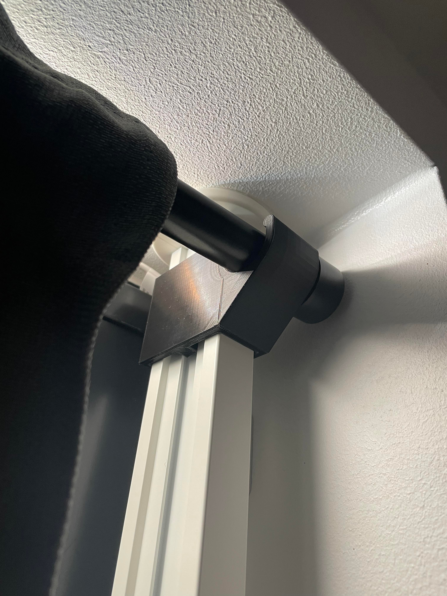
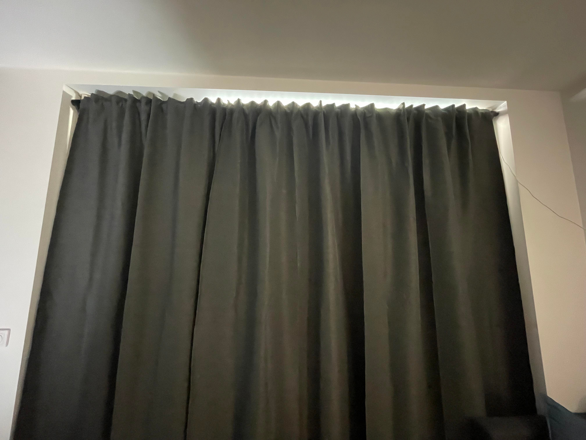

# IKEA ELVARLI curtain rod holder

Want to use curtains in an rental apartment without having to screw holes in the wall? Also, is the window too wide for a tension rod to work? Here is my solution: Buy two posts from IKEA (ELVARLI) and 3D-print this thing that can hold a long curtain rod (HUGAD)!

## Result

And this is the final result. No holes in wall and a fully adjustable curtain rod (both horizontally and vertically)!

