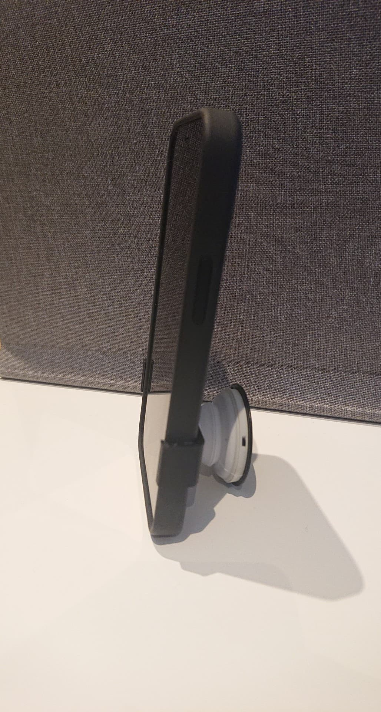
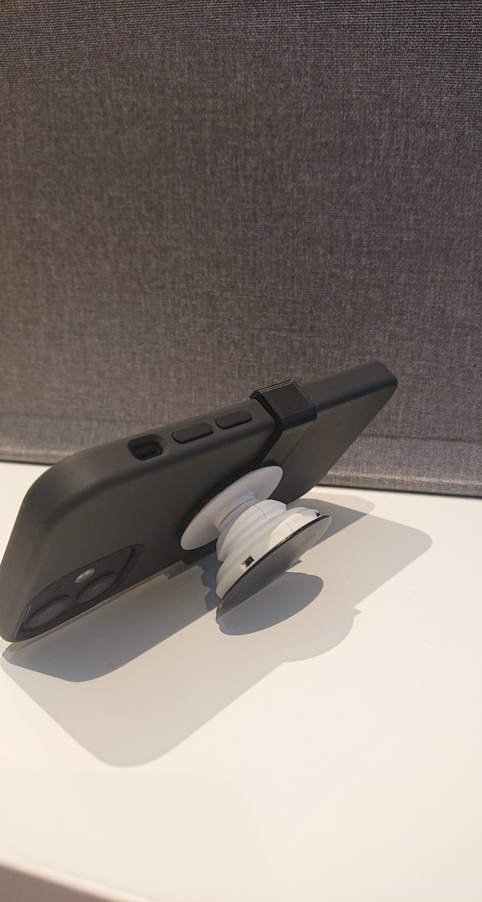
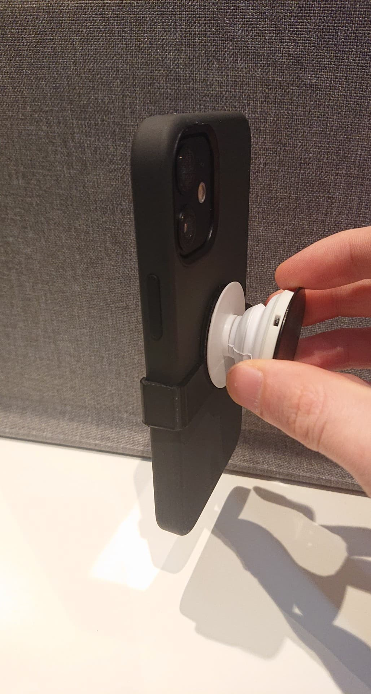
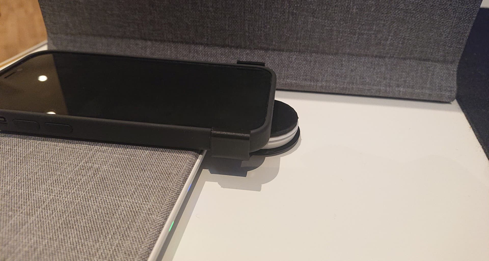

# iPhone 12 mini Popsocket holder

I may make justifications to this model in the future. It works fine for now, but I feel the grip around the phone won't last forever. It could also be nice to have the option to justify different parameters in the future using programming or something.

## Features

### 1. It can stand in both portait and landscape orientation:

### 2. It has good enough grip to be held by popsocket only:

### 3. It can use the wireless charger as the holder is movable!

