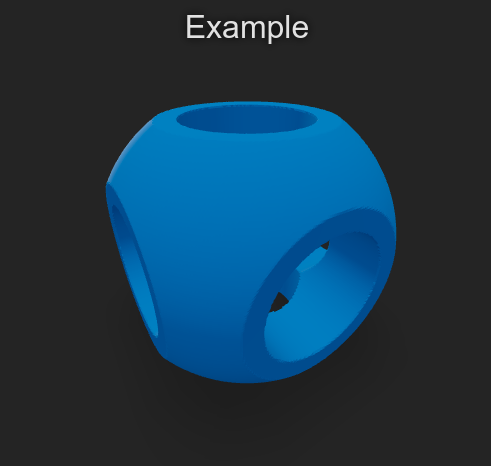

# SDF to Mesh generator and previewer

Here you can find models made using the SDF technique (Signed Distance Field). I have also provided tooling for converting them over to meshes (using [fogleman/sdf](https://github.com/fogleman/sdf)) and previewing them in the browser (using [react-stl-viewer](https://www.npmjs.com/package/react-stl-viewer)). CLI is provided to run these tools.

## How to run

Requirements:

- Node.js
- Docker & Docker Compose
- Bash

```bash
# Run this from the root folder / (not /sdf)

# Create the STL model from example.py -> example.stl
python3 sdf.py sdf/example.py

# Watch for changes & preview model in browser
python3 sdf.py sdf/example.py -wp
```

## CLI arguments

```bash
usage: sdf.py [-w] [-p] [--help] file

Generate mesh models from SDF using marching cubes.

positional arguments:
  file           Python filename (with extension)

optional arguments:
  -w, --watch    Generate new mesh when file is changed
  -p, --preview  Preview mesh in browser
  --help         Show this help message and exit.
```

## What the previewer looks like


